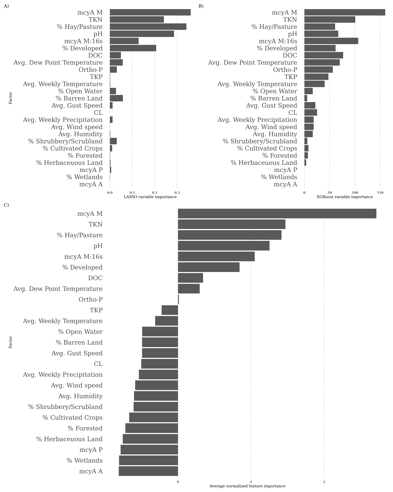
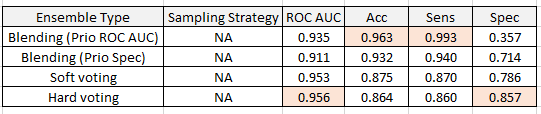

# One week ahead...

This repository contains the data and code required to reproduce the results and visualizations from the forthcoming paper "One week ahead prediction of harmful algal blooms in Iowa lakes." Harmful algal blooms occur in freshwater lakes during warmer seasons of the year and cause harm to humans, wildlife, and the surrounding environment. Based on weekly samples collected by the Iowa DNR, we trained several models in order to see how well we could predict harmful algal blooms one week before they occur. The result of this work are models that predit harmful algal blooms a week in advance with a high degree of specificity, and a dashboard that employs these models (in development). 

We used the `tidymodels` package and leveraged the `workflowsets` library to train multiple models (XGBoost, elastic net, neural networks, with a naive guessing strategy for baseline comparison) with different sampling strategies over a range of hyperparameter values to achieve this. `snakemake`, `conda`/`mamba`, and `renv` were used to make this pipeline reproducible. 

Some of the major challenges in this prediction problem were deciding which features were important and handling the heavy class imbalance.

## Feature selection

The full dataset for this project contained over 30 variables, including chemical data, qPCR readings, land use classification, and weather data. In order to decide which features were most predictive of the occurrence of harmful algal blooms, we used a resampling-based approach. After splitting the data into training and testing splits, we:

1. Resampled the training set 1000 times with replacement using `rsample::bootstraps`.
2. Trained an XGBoost model and a LASSO model on each split. The result of this step is 1000 trained XGBoost and LASSO models.
3. XGBoost and LASSO both assign feature importance scores to the features used in the model. For each model type, we calculated the average feature importance score for each feature (Figures A and B below).
4. We calculated an average normalized importance (ANI) by first normalizing the scores within each model type, then taking the mean of the importance scores for each feature (Figure C below).
5. These feature importance scores measure how predictive of harmful algal bloom status each feature is. Because normalizing centers scores on zero, anything with an ANI greater than 0 has greater than average importance. These are the features we use in our downstream analysis.

<p align="center">
  
</p>

*Feature selections scores. Click [here](figures/feature_importance/all_importances.png) to see the full-size image.*

## Class imbalances

The distribution of hazardous to non-hazardous samples is incredibly lopsided: after cleaning and preparing the data, only 70 samples of 1473 total samples (or less than 5%) were considered hazardous, which is is a class imbalance of 21 to 1. We tried some different strategies to address this.

### Correcting class imbalances through sampling strategies

* Oversampling the minority class using `themis::step_smote` to generate synthetic  hazardous samples. There are some definite concerns with generating so many samples of the minority class when the class imbalance is so big, such causing the model to overfit the training set or introducing a lot of noise into the minority class.
* Undersampling the majority class using `themis::step_downsample`. While it felt like a waste to throw away so much data to even out the class distributions, doing so might lead to learning both classes evenly during training. 

The aggregated results of the different sampling strategies are:

<p align="center">
  
</p>

Averaging all the models together (explained further below), we see that the oversampling strategy typically performed better across the board. There is an argument to be made to using downsampling: while ROC AUC was comparable between the two strategies, downsampling might be preferable due to decreased data set size and to prevent overfitting during model training. However, the improvement in specificity using oversampling (representing roughly 4 additional correct guesses) is significant enough, and our interest in correctly predicting the the hazardous cases is that much higher than in overall performance, that oversampling (in general) is the better choice.

Note that this analysis is on sampling strategies as a whole averaged over all models.


### Performance metrics

Since the classes were so imbalanced, accuracy was clearly a poor choice here - any model that just predicts that there wouldn't be a harmful algal bloom would achieve 95% accuracy. Thus, we relied on ROC AUC and specificity in order to pick our best performing models, though we also recorded sensitivity and accuracy as well. In addition, we used a "naive" prediction model as a baseline which predicted next week's hazard status to be the current week's. For example, if week n was non-hazardous, then the naive model predicted that week n + 1 would also be safe. 

Here are the results of the tuned model on the testing set, separated by model type and sampling strategy:

<p align="center">
  
</p>

XGBoost performed well overall, with some sort of XGBoost model achieving the best scores over all the metrics. Since ROC AUC and Specificity were our metrics of interest, the downsampled XGBoost appears to be the model of choice for use in actual prediction. 

The oversampled logistic regression is another choice worht considering, especially because it can be considered a simpler model while still achieving the same specificity and comparable ROC AUC. However, the accuracy and sensitivity are "significantly" lower, and even though predictions on the non-hazardous class are not as valuable for our study, there are real-world economic consequences for predicting false negatives (ie, predicting that a beach would experience a hazardous event when it does not) resulting from closures of lakes and beaches to recreational activity.

### Ensemble models

While the XGBoost models did perform well on our testing set, the sample size was only 14 hazardous samples. We next attempted ensemble modeling in order to boost all of the performance metrics. We created several ensemble models in order to improve the predictions. The candidates for the ensemble models were those models that performed the best in each of ROC AUC, accuracy, sensitivity, and specificity. Specifically, we used the over- and undersampled XGBoost models and the oversampled logistic regression. Our four ensemble models were:

* Blended predictions maximizing ROC AUC. This was constructed using the `stacks` package in R.
* Blended predictions maximizing specificity, using `stacks` as above.
* Soft voting using the average class probability from the three models.
* Hard voting by taking the majority class vote for the member models.

Performance metrics for the different strategies:

<p align="center">
  
</p>

According to our requirements for a high specificity and high ROC AUC, the hard voting strategy is the clear best candidate for implementation. 

## Repeating the analysis

After cloning the repo, restore the conda environment by doing:

```
mamba env create -f environment.yml
```

Then, activate the environment:

```
conda activate hab_prediction
```

You can then run the pipeline with:

```
snakemake -c 4
```

_(You can also do `snakemake -c 1` to use fewer cores.)_

This will restore the R environment, regenerate all the figures, and render the website.

## DAG of jobs

<p align="center">
  
</p>
