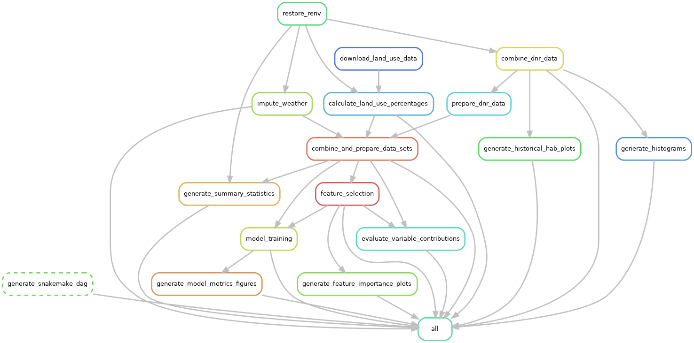

# One week ahead...

This repository contains the data and code required to reproduce the results and visualizations from the forthcoming paper "One week ahead prediction of harmful algal blooms in Iowa lakes." Harmful algal blooms occur in freshwater lakes during warmer seasons of the year and cause harm to humans, wildlife, and the surrounding environment. Based on weekly samples collected by the Iowa DNR, we trained several models in order to see how well we could predict harmful algal blooms one week before they occur. The result of this work are models that predit harmful algal blooms a week in advance with a high degree of specificity, and a dashboard that employs these models (in development). 

We used the `tidymodels` package and leveraged the `workflowsets` library to train multiple models (XGBoost, elastic net, neural networks, with a naive guessing strategy for baseline comparison) with different sampling strategies to achieve this. We also used `snakemake`, `conda`/`mamba`, and `renv` to make this pipeline reproducible. 

Some of the major challenges in this prediction problem were deciding which features were important and handling the heavy class imbalance.

## Feature selection

The full dataset for this project contained over 30 variables, including chemical data, qPCR readings, land use classification, and weather data. In order to decide which features were most predictive of the occurrence of harmful algal blooms, we used a resampling-based approach. After splitting the data into training and testing splits, we:

1. Resampled the training set 1000 times with replacement using `rsample::bootstraps`.
2. Trained an XGBoost model and a LASSO model on each split. The result of this step is 1000 trained XGBoost and LASSO models.
3. XGBoost and LASSO both assign feature importance scores to the features used in the model. For each model type, we calculated the average feature importance score for each feature (Figures A and B below).
4. We calculated an average normalized importance (ANI) by first normalizing the scores within each model type, then taking the mean of the importance scores for each feature (Figure C below).
5. These feature importance scores measure how predictive of harmful algal bloom status each feature is. Because normalizing centers scores on zero, anything with an ANI greater than 0 has greater than average importance. These are the features we use in our downstream analysis.

<p align="center">
  
</p>

*Feature selections scores. Click [here](figures/feature_importance/all_importances.png) to see the full-size image.*

## Class imbalances

After data preparation and cleaning, the distribution hazardous to non-hazardous samples is incredibly lopsided: of 1473 total samples, only 70 samples (or less than 5%) were considered hazardous. This is a class imbalance of 21 to 1, a far cry from an even class distribution. We tried three different strategies to address this:

### Correcting class imbalances through sampling strategies

* Oversampling the minority class using `themis::step_smote` to generate synthetic  hazardous samples
* Undersampling the majority class using `themis::step_downsample`

### Performance metrics

Since the classes were so imbalanced, accuracy was clearly a poor choice here - any model that just predicts that there wouldn't be a harmful algal bloom would achieve 95% accuracy. Thus, we relied on ROC AUC and specificity in order to pick our best performing models.


### Ensemble models

We created several ensemble models in order to improve the predictions. The candidates for the ensemble models were those models that performed the best in each of ROC AUC, accuracy, sensitivity, and specificity.


## Repeating the analysis

After cloning the repo, restore the conda environment by doing:

```
mamba env create -f environment.yml
```

Then, activate the environment:

```
conda activate hab_prediction
```

You can then run the pipeline with:

```
snakemake -c 4
```

_(You can also do `snakemake -c 1` to use fewer cores.)_

This will restore the R environment, regenerate all the figures, and render the website.

## DAG of jobs

<p align="center">
  
</p>
